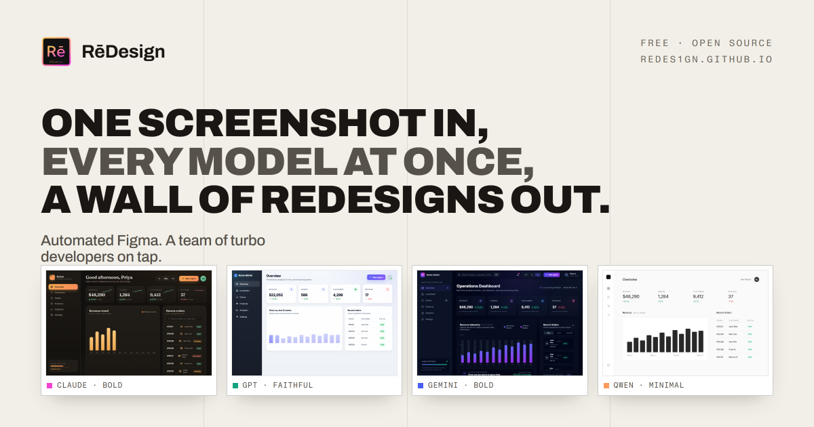

# RēDesign

**One screenshot in. A wall of AI redesigns out.**

The public landing page for RēDesign, live at **[redes1gn.github.io](https://redes1gn.github.io/)**.



## What this is

RēDesign takes a single UI screenshot, runs it past a bunch of top AI models at the same time (Claude, GPT, Gemini, DeepSeek, Qwen, plus any you add yourself), and gives you a browsable wall of self-contained HTML redesigns to compare side by side with the original.

This repository is just the marketing site for it. The whole thing is one self-contained `index.html` served by GitHub Pages.

## Live site

> **https://redes1gn.github.io/**

## How it is built

- **One self-contained file.** All of the CSS and every illustration (SVG) live inline in `index.html`. What is in the file is exactly what ships.
- **No build step, no framework, no dependencies.** Nothing to install, nothing to compile.
- **One network request.** The only thing the page fetches is the Inter font from Google Fonts. Everything else is local.
- **Hosted on GitHub Pages** straight from the `main` branch. The `.nojekyll` file tells Pages to serve the files as-is instead of running them through Jekyll.
- **Responsive** from a 375px phone up to a wide desktop, with a light and dark friendly palette, a violet accent, and the pink-to-gold brand gradient.

## What is in here

| File | What it is |
| --- | --- |
| `index.html` | The entire landing page |
| `og-image.png` | 1200x630 social share card (Open Graph / Twitter) |
| `icon.svg`, `favicon.ico` | Site icons |
| `.nojekyll` | Serve files as-is on GitHub Pages, skip Jekyll |
| `CHANGELOG.md` | What changed and when |

## Preview it locally

Any static file server works. For example:

```sh
npx serve .
# or
python -m http.server 8000
```

Then open the URL it prints.

## Updating the page

Edit `index.html` and push to `main`. GitHub Pages redeploys in about a minute. To regenerate the share card, re-render the card template to `og-image.png` at 1200x630.

## Related

The RēDesign application itself (the tool that does the work) lives at **[LunarWerxs/ReDesign](https://github.com/LunarWerxs/ReDesign)**.
